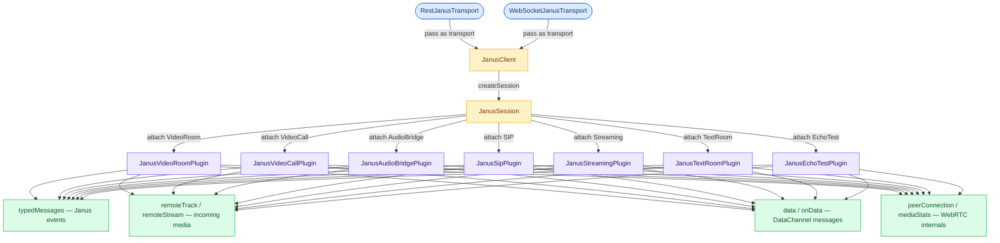

# janus_client 
[](https://januscaler.com)  

[](https://pub.dartlang.org/packages/janus_client)[](https://gitter.im/flutter_janus_client/Lobby?utm_source=badge&utm_medium=badge&utm_campaign=pr-badge)
<!-- ALL-CONTRIBUTORS-BADGE:START - Do not remove or modify this section -->
[](#contributors-)
<!-- ALL-CONTRIBUTORS-BADGE:END -->

## Table of Contents

- [Package title & intro](#janus_client)
- [What it will / will not do](#what-it-will-do)
- [Demo / API Reference / Wiki / links](#demo-of-janusclient)
- [Developer Guide & API Reference](#developer-guide--api-reference)
  - [Quick start](#quick-start)
  - [Architecture overview](#architecture-overview)
  - [Core API](#core-api)
    - [JanusClient](#janusclient)
    - [JanusSession](#janussession)
    - [JanusTransport (REST & WebSocket)](#janustransport-rest--websocket)
    - [JanusPlugin (shared)](#janusplugin-shared)
    - [JanusError & typed events](#januserror--typed-events)
    - [Utility helpers (`utils.dart`)](#utility-helpers-utilsdart)
  - [Wrapper plugins](#wrapper-plugins)
    - [JanusVideoRoomPlugin](#janusvideoroomplugin)
    - [JanusVideoCallPlugin](#janusvideocallplugin)
    - [JanusAudioBridgePlugin](#janusaudiobridgeplugin)
    - [JanusSipPlugin](#janussipplugin)
    - [JanusStreamingPlugin](#janusstreamingplugin)
    - [JanusTextRoomPlugin](#janustextroomplugin)
    - [JanusEchoTestPlugin](#janusechotestplugin)
    - [Plugin quick-reference table](#plugin-quick-reference-table)
  - [Desktop screen capture UI](#desktop-screen-capture-ui)
  - [Bitrate & network quality](#bitrate--network-quality)
  - [Scenarios cookbook](#scenarios-cookbook)
  - [Gotchas & cross-cutting notes](#gotchas--cross-cutting-notes)
  - [Version & migration notes](#version--migration-notes)
- [News & Updates](#news--updates)
- [Feature Status](#feature-status)
- [WebRTC Feature Support & Testing Matrix](#webrtc-feature-support--testing-matrix)
- [Contributors](#contributors-)
- [JavaScript client (`typed_janus_js`)](#wait-theres-more-the-javascript-client)
- [Donations](#donations)

It is a feature rich flutter package, which offers all webrtc operations supported by [Janus: the general purpose WebRTC server](https://janus.conf.meetecho.com/),
it easily integrates into your flutter application and allows you to build webrtc features and functionality with clean and maintainable code.

> [!NOTE]
> ## What it will do?
> - It will help you in establishing communication with Janus server using either REST or Websocket depending on what you prefer 
> - It will provide you meaningful APIs for individual plugins so you can express your app logic without worrying about internals
> ## What it will not do?
> It will not manage every aspect of WebRTC for you by that we mean we only provide core functionalities and features when it comes to WebRTC, since this library uses flutter_webrtc for managing all of webrtc stack so you will need to refer its documentation when there's some use cases which we do not cover or does not exist in examples. This is done intentionally by design to give developers complete flexibility while also making sure library is lightweight and does not become a bloatware.
A classic example of that would be changing output device on a native device for example you want to switch from speaker to headsets or bluetooth audio device you will need to use `flutter_webrtc`'s `Helper` utility class:-   
>```dart 
>Helper.selectAudioOutput(deviceIdOfBluetoothDevice) 
>``` 


## [Demo of JanusClient](https://januscaler.github.io/flutter_janus_client/)

## [APIReference](https://januscaler.github.io/flutter_janus_client/doc/api/)

## [Wiki](https://github.com/januscaler/flutter_janus_client/wiki)

## [Take away apple specific pain for building flutter app](https://github.com/januscaler/flutter_janus_client/wiki/Take-away-Apple-IOS-and-macOS-related-pain-from-me-%F0%9F%92%AF-(building-for-apple))

## [screen share example](https://github.com/januscaler/screenshare_example)

## Developer Guide & API Reference

Full generated docs: [API reference](https://januscaler.github.io/flutter_janus_client/doc/api/).

### Quick start

```dart
final ws = WebSocketJanusTransport(url: 'wss://your-janus.example/janus');
final client = JanusClient(
  transport: ws,
  iceServers: [RTCIceServer(urls: 'stun:stun.l.google.com:19302')],
);
final session = await client.createSession();
final echo = await session.attach<JanusEchoTestPlugin>();
// now call initializeMediaDevices / createOffer / send on echo
```

Swap `WebSocketJanusTransport` for `RestJanusTransport` to use HTTP long-polling instead.

### Architecture overview



---

### Core API

#### JanusClient

[`lib/janus_client.dart`](lib/janus_client.dart)

| Constructor param | Default | What it does |
|---|---|---|
| `transport` | required | `RestJanusTransport` or `WebSocketJanusTransport` |
| `iceServers` | `null` | ICE servers passed to every peer connection |
| `isUnifiedPlan` | `true` | Use unified-plan SDP (recommended) |
| `apiSecret` / `token` | `null` | Auth; only sent when `withCredentials: true` |
| `stringIds` | `false` | Coerce room ids to strings in plugin payloads |
| `refreshInterval` | `50` | Session keepalive interval (seconds) |

| Method | Returns | Notes |
|---|---|---|
| `createSession()` | `Future<JanusSession>` | Calls `session.create()` internally; errors are caught and logged — check `sessionId` if something fails |
| `getInfo()` | `Future<JanusClientInfo>` | Fetch Janus server info |

#### JanusSession

[`lib/janus_session.dart`](lib/janus_session.dart)

| API | Notes |
|---|---|
| `create()` | Opens session on Janus; starts keepalive |
| `attach<T extends JanusPlugin>({opaqueId})` | Returns a typed plugin handle (`JanusVideoRoomPlugin`, `JanusVideoCallPlugin`, `JanusAudioBridgePlugin`, `JanusSipPlugin`, `JanusStreamingPlugin`, `JanusTextRoomPlugin`, `JanusEchoTestPlugin`) |
| `dispose()` | Tears down the session **and** the shared transport |
| `sessionId` | Populated after `create()` |

#### JanusTransport

[`lib/janus_transport.dart`](lib/janus_transport.dart)

**`WebSocketJanusTransport`** — preferred for low latency.

| Param | Default | Notes |
|---|---|---|
| `url` | required | `wss://…` |
| `sendCompleterTimeout` | 20s | How long `send` waits for an ack |
| `autoReconnect` | `true` | |
| `heartbeatInterval` | 10s | |
| `maxMessageMissedRetries` | 3 | |
| `maxReconnectAttempts` | 5 | |

**`RestJanusTransport`** — works everywhere. `post` / `get` return **`null`** on errors instead of throwing.

#### JanusPlugin (base)

[`lib/janus_plugin.dart`](lib/janus_plugin.dart) — every plugin handle inherits these.

**Streams you subscribe to:**

| Stream | What arrives |
|---|---|
| `typedMessages` | Janus plugin events as typed Dart classes |
| `messages` | Raw Janus JSON events |
| `remoteTrack` / `remoteStream` | Incoming audio/video tracks |
| `data` / `onData` | DataChannel messages |
| `renegotiationNeeded` | SDP renegotiation trigger |

**Methods you call:**

| Method | Notes |
|---|---|
| `initializeWebRTCStack()` | Create `RTCPeerConnection` |
| `initializeMediaDevices({mediaConstraints, useDisplayMediaDevices, desktopCaptureContext, screenSelectDialogBuilder, ...})` | `getUserMedia` or `getDisplayMedia`; for desktop capture pass `desktopCaptureContext` + optionally a custom `screenSelectDialogBuilder` |
| `createOffer()` / `createAnswer()` | SDP negotiation |
| `handleRemoteJsep(jsep)` | `setRemoteDescription` |
| `send({data, jsep})` | Send a Janus message |
| `initDataChannel()` / `sendData(msg)` | DataChannel setup and send |
| `hangup({disposeStream})` / `dispose()` | Teardown |
| `getBitrate()` / `watchNetworkQualityLevel()` | Stats — see **Bitrate & network quality** |

#### JanusError & typed events

[`lib/interfaces/typed_event.dart`](lib/interfaces/typed_event.dart)

```dart
plugin.typedMessages?.listen((TypedEvent e) {
  final data = e.event.plugindata?.data;
  // data is a typed event class — pattern-match per plugin below
  await plugin.handleRemoteJsep(e.jsep);
}, onError: (e) {
  if (e is JanusError) { /* handle */ }
});
```

---

### Wrapper plugins

#### JanusVideoRoomPlugin

[`lib/wrapper_plugins/janus_video_room_plugin.dart`](lib/wrapper_plugins/janus_video_room_plugin.dart) · SFU rooms, simulcast, dynamic subscriber feeds.

**Key methods:** `joinPublisher`, `joinSubscriber`, `publishMedia`, `configure`, `subscribeToStreams`, `update`, `unsubscribe`, `unpublish`, `createRoom`, `destroyRoom`, `getRooms`, `getRoomParticipants`, `hangup`

```dart
final plugin = await session.attach<JanusVideoRoomPlugin>();
plugin.typedMessages?.listen((e) async {
  if (e.event.plugindata?.data is VideoRoomJoinedEvent) {
    await plugin.configure(
      sessionDescription: await plugin.createOffer(audioRecv: false, videoRecv: false));
  }
  await plugin.handleRemoteJsep(e.jsep);
});
await plugin.joinPublisher(roomId, displayName: 'Alice');
```

**Typed events:** `VideoRoomJoinedEvent`, `VideoRoomConfigured`, `VideoRoomNewPublisherEvent`, `VideoRoomAttachedEvent`, `VideoRoomLeavingEvent`, `VideoRoomUnPublishedEvent`, …

---

#### JanusVideoCallPlugin

[`lib/wrapper_plugins/janus_video_call_plugin.dart`](lib/wrapper_plugins/janus_video_call_plugin.dart) · 1:1 registered calls.

**Key methods:** `register`, `call`, `acceptCall`, `set`, `getList`, `hangup`

```dart
await plugin.register('Alice');
await plugin.initializeMediaDevices(mediaConstraints: {'audio': true, 'video': true});
await plugin.call('Bob', offer: await plugin.createOffer(audioRecv: true, videoRecv: true));
```

> **`hangup()` calls `dispose()`** — the plugin handle cannot be reused after hanging up.

---

#### JanusAudioBridgePlugin

[`lib/wrapper_plugins/janus_audio_bridge_plugin.dart`](lib/wrapper_plugins/janus_audio_bridge_plugin.dart) · Audio-only conferencing.

**Key methods:** `createRoom` (`permanent` defaults `true`), `joinRoom`, `configure`, `muteParticipant`, `kickParticipant`, `rtpForward`, `stopRtpForward`, `listParticipants`, `hangup`

```dart
await plugin.initializeMediaDevices(mediaConstraints: {'audio': true, 'video': false});
await plugin.joinRoom(roomId, display: 'Alice');
plugin.typedMessages?.listen((e) async {
  if (e.event.plugindata?.data is AudioBridgeJoinedEvent) await plugin.configure();
  await plugin.handleRemoteJsep(e.jsep);
});
```

---

#### JanusSipPlugin

[`lib/wrapper_plugins/janus_sip_plugin.dart`](lib/wrapper_plugins/janus_sip_plugin.dart) · WebRTC ↔ SIP gateway.

**Key methods:** `register`, `unregister`, `call`, `accept`, `decline`, `hangup`, `hold(SipHoldState)`, `unhold`, `transfer`, `recording`

> No built-in DTMF wrapper — use raw `send` if your Janus build supports it.

---

#### JanusStreamingPlugin

[`lib/wrapper_plugins/janus_streaming_plugin.dart`](lib/wrapper_plugins/janus_streaming_plugin.dart) · Consume RTSP/RTP live streams.

**Key methods:** `listStreams`, `watchStream`, `startStream`, `pauseStream`, `stopStream`, `switchStream`, `getStreamInfo`, `createStream`, `editStream`, `destroyStream`

```dart
await plugin.watchStream(mountId);
plugin.typedMessages?.listen((e) async {
  if (e.event.plugindata?.data is StreamingPluginPreparingEvent) {
    await plugin.handleRemoteJsep(e.jsep);
    await plugin.startStream();
  }
});
```

---

#### JanusTextRoomPlugin

[`lib/wrapper_plugins/janus_text_room_plugin.dart`](lib/wrapper_plugins/janus_text_room_plugin.dart) · Text chat over DataChannel.

**Key methods:** `setup`, `joinRoom`, `sendMessage`, `leaveRoom`, `listRooms`, `listParticipants`, `createRoom`, `destroyRoom`

```dart
await plugin.setup();
plugin.data?.listen((msg) { /* parse TextRoom JSON */ });
await plugin.joinRoom(roomId, username, display: username);
await plugin.sendMessage(roomId, 'hello');
```

> Chat events arrive on **`data`**, not `typedMessages`.

---

#### JanusEchoTestPlugin

[`lib/wrapper_plugins/janus_echo_test_plugin.dart`](lib/wrapper_plugins/janus_echo_test_plugin.dart) · Loopback connectivity test. No extra methods — use the base `JanusPlugin` API directly.

---

#### Plugin quick-reference

| Plugin | Key entrypoints | Events arrive on |
|---|---|---|
| VideoRoom | `joinPublisher` · `joinSubscriber` · `publishMedia` · `subscribeToStreams` | `typedMessages` |
| VideoCall | `register` · `call` · `acceptCall` · `hangup` | `typedMessages` |
| AudioBridge | `joinRoom` · `configure` · `muteParticipant` | `typedMessages` |
| SIP | `register` · `call` · `accept` · `hold` / `unhold` | `typedMessages` |
| Streaming | `watchStream` · `startStream` · `stopStream` | `typedMessages` + SDP via `messages` |
| TextRoom | `setup` · `joinRoom` · `sendMessage` | **`data` channel** |
| EchoTest | `send` + manual SDP | `messages` |

---

### Desktop screen capture UI

[`lib/widgets/screen_select.dart`](lib/widgets/screen_select.dart) · [`screen_select_compact.dart`](lib/widgets/screen_select_compact.dart) · [`screen_select_sidebar.dart`](lib/widgets/screen_select_sidebar.dart)

| Widget | Layout |
|---|---|
| `ScreenSelectDialog` | Default Material grid picker |
| `CompactScreenSelectDialog` | Segmented tabs + badge thumbnails |
| `SidebarScreenSelectDialog` | Sidebar list + large preview |

Pass via `initializeMediaDevices`:

```dart
await plugin.initializeMediaDevices(
  useDisplayMediaDevices: true,
  desktopCaptureContext: context,
  screenSelectDialogBuilder: (_) => const CompactScreenSelectDialog(),
);
```

Subclass `ScreenSelectDialogState` and override `buildHeader`, `buildTabs`, `buildBody`, `buildSourceGrid`, `buildThumbnail`, `buildEmpty`, `buildLoading`, or `buildActions` for full custom layouts.

---

### Bitrate & network quality

Each plugin handle exposes `mediaStats` ([`JanusStreamStats`](lib/janus_plugin.dart)).

| API | Returns |
|---|---|
| `getBitrate([mid])` | Human-readable label (empty until first measurement) |
| `getBitrateMeasurement(query)` | Structured `BitrateMeasurement` |
| `getNetworkQuality(query)` / `watchNetworkQuality(query)` | One-shot / stream of `double` quality score |
| `watchNetworkQualityLevel(thresholds)` | Stream of `NetworkQualityLevel` enum |

---

### Scenarios cookbook

| Goal | Start here |
|---|---|
| 1:1 video call | [`JanusVideoCallPlugin`](lib/wrapper_plugins/janus_video_call_plugin.dart) · [`video_call.dart`](example/lib/typed_examples/video_call.dart) |
| Multi-party SFU + simulcast | [`JanusVideoRoomPlugin`](lib/wrapper_plugins/janus_video_room_plugin.dart) · [`google_meet.dart`](example/lib/typed_examples/google_meet.dart) |
| Audio-only conference | [`JanusAudioBridgePlugin`](lib/wrapper_plugins/janus_audio_bridge_plugin.dart) · [`audio_bridge.dart`](example/lib/typed_examples/audio_bridge.dart) |
| SIP ↔ WebRTC | [`JanusSipPlugin`](lib/wrapper_plugins/janus_sip_plugin.dart) · [`sip.dart`](example/lib/typed_examples/sip.dart) |
| Live RTSP/RTP stream | [`JanusStreamingPlugin`](lib/wrapper_plugins/janus_streaming_plugin.dart) · [`streaming.dart`](example/lib/typed_examples/streaming.dart) |
| Text chat | [`JanusTextRoomPlugin`](lib/wrapper_plugins/janus_text_room_plugin.dart) · [`text_room.dart`](example/lib/typed_examples/text_room.dart) |
| Connectivity / echo test | [`JanusEchoTestPlugin`](lib/wrapper_plugins/janus_echo_test_plugin.dart) |
| Desktop screen share + custom picker | `initializeMediaDevices(useDisplayMediaDevices, desktopCaptureContext, screenSelectDialogBuilder)` |
| Bitrate / signal-strength HUD | `watchNetworkQualityLevel` + `getBitrate` — see [`google_meet.dart`](example/lib/typed_examples/google_meet.dart) overlays |

---

### Gotchas

- **`JanusSession.dispose()`** also disposes the transport — all sessions sharing that transport are affected.
- **`JanusVideoCallPlugin.hangup()`** calls `dispose()` internally — create a new handle to call again.
- **`withCredentials: false` (default)** means `apiSecret` / `token` are never sent even if set.
- **REST `post`** returns `null` on failure, not an exception — check return values.
- **WebSocket `send`** swallows errors when disconnected — validate signaling outcomes in your UI.
- **TextRoom `editRoom`** sends `"textroom":"create"` — verify against your Janus server version.
- **Apple screen share** requires entitlements — see [wiki](https://github.com/januscaler/flutter_janus_client/wiki/Take-away-Apple-IOS-and-macOS-related-pain-from-me-%F0%9F%92%AF-(building-for-apple)).
- **`flutter_webrtc` features** (e.g. `Helper.selectAudioOutput`) are out of scope — see the callout at the top of this README.

---

### Version & migration notes

**Current:** `2.4.5` ([`pubspec.yaml`](pubspec.yaml)) — see full [CHANGELOG.md](CHANGELOG.md).

| Version | Change |
|---|---|
| 2.4.0 | Desktop display capture in `initializeMediaDevices`; `sendCompleterTimeout` on WS transport |
| 2.4.1 | `maxMessageMissedRetries` on `WebSocketJanusTransport` |
| 2.4.2 | `JanusStreamStats`, `getNetworkQuality`, `watchNetworkQuality` |
| 2.4.3 | `disposeStream` param on `hangup` across plugins |
| 2.4.4 | REST polling URL fix; `JanusPlugin.buildPollingUri` |
| 2.4.5 | `ScreenSelectDialog` family + `screenSelectDialogBuilder` on `initializeMediaDevices` |
## News & Updates
- Introduced support for simulcast
- videoroom and screenshare improvements (screenshare tested on android and chrome)
- sip plugin wrapper added with sip calling example
- Added errorHandler for typedMessage Stream for better development flow
- Just like new flutter version comes With desktop support out of the box
- All major plugins fully support unified plan
- Typed examples updated with null safety and latest dart constraints
- Introduced plugin specific wrapper classes with respective operation methods for rich development experience
- Introduced typed events (Class Based Events) for brilliant auto completion support for IDE
- Supports null-safety

## Feature Status
| Feature           | Support | Well Tested | Unified Plan | Example |
|-------------------|---------|-------------|--------------|---------|
| WebSocket         | Yes     | Yes         | -            | Yes     |
| Rest/Http API     | Yes     | Yes         | -            | Yes     |
| Video Room Plugin | Yes     | No         | Yes          | Yes     |
| Video Call Plugin | Yes     | No          | Yes          | Yes     |
| Streaming Plugin  | Yes     | No          | Yes          | Yes     |
| Audio Room Plugin | Yes     | No          | Yes          | Yes     |
| Sip Plugin        | Yes     | No          | Yes           | Yes      |
| Text Room Plugin  | Yes     | No          | -          | Yes     |
| ScreenSharing using VideoRoom plugin  | Yes     | No          | Yes          | Yes     |

# WebRTC Feature Support & Testing Matrix

| Feature        | Android  | iOS  | Windows  | Linux  | macOS  | Browser  |
|---------------|---------|------|---------|--------|--------|---------|
| **VideoRoom** | ✅ (🟢) | ✅ (🟡) | ✅ (🟡) | ✅ (🟡) | ✅ (🟢) | ✅ (🟢) |
| **VideoCall** | ✅ (🟢) | ✅ (🟡) | ✅ (🟡) | ✅ (🟡) | ✅ (🟡) | ✅ (🟢) |
| **SIP**       | ✅ (🟢) | ✅ (🟡) | ✅ (🟡) | ✅ (🟡) | ✅ (🟡) | ✅ (🟢) |
| **AudioRoom** | ✅ (🟢) | ✅ (🟡) | ✅ (🟡) | ✅ (🟡) | ✅ (🟡) | ✅ (🟢) |
| **Streaming** | ✅ (🟢) | ✅ (🟡) | ✅ (🟡) | ✅ (🟡) | ✅ (🟡) | ✅ (🟢) |

## Legend:
- ✅ = Supported
- ❌ =  Supported
- 🟢 = Tested
- 🟡 =  Not fully Tested

## Contributors ✨

Thanks goes to these wonderful people ([emoji key](https://allcontributors.org/docs/en/emoji-key)):

<!-- ALL-CONTRIBUTORS-LIST:START - Do not remove or modify this section -->
<!-- prettier-ignore-start -->
<!-- markdownlint-disable -->
<table>
  <tbody>
    <tr>
      <td align="center" valign="top" width="14.28%"><a href="https://github.com/shivanshtalwar0"><br /><sub><b>Shivansh Talwar</b></sub></a><br /><a href="https://github.com/januscaler/flutter_janus_client/commits?author=shivanshtalwar0" title="Code">💻</a> <a href="https://github.com/januscaler/flutter_janus_client/commits?author=shivanshtalwar0" title="Documentation">📖</a></td>
      <td align="center" valign="top" width="14.28%"><a href="https://github.com/kzawadi"><br /><sub><b>Kelvin Zawadi</b></sub></a><br /><a href="https://github.com/januscaler/flutter_janus_client/commits?author=kzawadi" title="Code">💻</a></td>
      <td align="center" valign="top" width="14.28%"><a href="https://github.com/LifeNow"><br /><sub><b>Eugene</b></sub></a><br /><a href="https://github.com/januscaler/flutter_janus_client/commits?author=LifeNow" title="Code">💻</a></td>
      <td align="center" valign="top" width="14.28%"><a href="https://github.com/igala"><br /><sub><b>Igal Avraham</b></sub></a><br /><a href="https://github.com/januscaler/flutter_janus_client/commits?author=igala" title="Code">💻</a></td>
      <td align="center" valign="top" width="14.28%"><a href="http://vigikaran.me/"><br /><sub><b>Vigikaran</b></sub></a><br /><a href="https://github.com/januscaler/flutter_janus_client/commits?author=vigikaran" title="Code">💻</a></td>
      <td align="center" valign="top" width="14.28%"><a href="https://github.com/UserSense"><br /><sub><b>UserSense</b></sub></a><br /><a href="https://github.com/januscaler/flutter_janus_client/commits?author=UserSense" title="Code">💻</a></td>
      <td align="center" valign="top" width="14.28%"><a href="https://github.com/baihua666"><br /><sub><b>baihua666</b></sub></a><br /><a href="https://github.com/januscaler/flutter_janus_client/issues?q=author%3Abaihua666" title="Bug reports">🐛</a></td>
    </tr>
    <tr>
      <td align="center" valign="top" width="14.28%"><a href="https://github.com/ngoluuduythai"><br /><sub><b>ngoluuduythai</b></sub></a><br /><a href="https://github.com/januscaler/flutter_janus_client/commits?author=ngoluuduythai" title="Code">💻</a></td>
      <td align="center" valign="top" width="14.28%"><a href="https://www.facebook.com/sakshamgupta12"><br /><sub><b>Saksham Gupta</b></sub></a><br /><a href="https://github.com/januscaler/flutter_janus_client/commits?author=sakshamgupta05" title="Code">💻</a></td>
      <td align="center" valign="top" width="14.28%"><a href="https://github.com/chu06"><br /><sub><b>chu06</b></sub></a><br /><a href="https://github.com/januscaler/flutter_janus_client/commits?author=chu06" title="Code">💻</a></td>
      <td align="center" valign="top" width="14.28%"><a href="https://github.com/musagil"><br /><sub><b>Musagil Musabayli</b></sub></a><br /><a href="https://github.com/januscaler/flutter_janus_client/commits?author=musagil" title="Code">💻</a></td>
      <td align="center" valign="top" width="14.28%"><a href="https://github.com/mazen930"><br /><sub><b>Mazen Amr</b></sub></a><br /><a href="https://github.com/januscaler/flutter_janus_client/commits?author=mazen930" title="Code">💻</a></td>
      <td align="center" valign="top" width="14.28%"><a href="https://github.com/Clon1998"><br /><sub><b>Patrick Schmidt</b></sub></a><br /><a href="https://github.com/januscaler/flutter_janus_client/commits?author=Clon1998" title="Code">💻</a></td>
      <td align="center" valign="top" width="14.28%"><a href="https://github.com/ivansapr"><br /><sub><b>Ivan Saprykin</b></sub></a><br /><a href="https://github.com/januscaler/flutter_janus_client/commits?author=ivansapr" title="Code">💻</a></td>
    </tr>
    <tr>
      <td align="center" valign="top" width="14.28%"><a href="https://github.com/Creiger"><br /><sub><b>Lukas Hronec</b></sub></a><br /><a href="https://github.com/januscaler/flutter_janus_client/commits?author=Creiger" title="Code">💻</a></td>
      <td align="center" valign="top" width="14.28%"><a href="https://github.com/dev-satoshi"><br /><sub><b>Satoshi</b></sub></a><br /><a href="https://github.com/januscaler/flutter_janus_client/commits?author=dev-satoshi" title="Code">💻</a></td>
      <td align="center" valign="top" width="14.28%"><a href="https://github.com/emekalites"><br /><sub><b>Chukwuemeka Ihedoro</b></sub></a><br /><a href="https://github.com/januscaler/flutter_janus_client/commits?author=emekalites" title="Code">💻</a></td>
    </tr>
  </tbody>
</table>

<!-- markdownlint-restore -->
<!-- prettier-ignore-end -->

<!-- ALL-CONTRIBUTORS-LIST:END -->

This project follows the [all-contributors](https://github.com/all-contributors/all-contributors) specification. Contributions of any kind welcome!

## Wait there's more... The Javascript Client!
If you loved the api style and architecture of flutter_janus_client and you wishing to have something similar for your next javascript project involving webrtc features.
then worry not because we have got you covered. we have written wrapper on top of our good old `janus.js`, you might ask why? well the answer to that question is it does not support
type bindings hence no rich ide support, so we proudly presents [typed_janus_js(feature rich promisified and reactive wrapper on top of janus.js)](https://github.com/flutterjanus/JanusJs)
or you can straight away use it by installing from npm `npm i typed_janus_js`.

## Donations 
[](https://ko-fi.com/U7U11OZL8)  

<a href="https://www.buymeacoffee.com/gr20hjk" target="_blank"></a>
